<a href="https://prathamp18.github.io/portfolio/">
  
</a>

<p align="center">
  <a href="https://prathamp18.github.io/portfolio/"></a>
  <a href="https://www.linkedin.com/in/pratham-patel18"></a>
  <a href="mailto:patelpratham1218@gmail.com"></a>
  <a href="https://prathamp18.github.io/portfolio/Pratham_Patel_Resume.pdf"></a>
</p>


```typescript
const pratham = {
  studying:   "B.Sc. (Hons) Computer Science @ York University, Lassonde — May 2027",
  basedIn:    "Toronto, ON",
  prev:       "SWE Intern, AI & Automation @ Aviva Canada",
  lookingFor: ["SWE / SDE", "AI / ML Engineering", "Data", "Quant"],
  openTo:     "Winter 2027 internships · new-grad full-time, Summer 2027",
  thesis:     "Calling an LLM is easy. Making it reliable is the job.",
  languages:  ["English", "Gujarati", "Hindi"],
  now:        "Building DetourTO — a disruption-aware TTC trip-planning agent",
} as const;
```

---

## 🏭 In production

What I shipped at **Aviva Canada** (AI & Automation, Jan – Aug 2026) and **TourWalk** (May – Aug 2025). Code is proprietary; the numbers are real.

| | System | What it did | Moved | Stack |
|:-:|---|---|:-:|---|
| 🤖 | **GenAI test-authoring platform** | Reads a Jira story, writes the structured API + UI test cases. Prompt chaining, context-grounded generation, JSON-schema validation on every output | **−80%** authoring time | AWS Bedrock · Claude · Azure DevOps |
| 🧭 | **Copilot-style QA agent** | LLM intent router + multimodal RAG (images, PDFs, docs) so non-technical QA teams edit test suites in plain English | **90%** intent accuracy | RAG · Agentic AI · Bedrock |
| 💬 | **Agentic auto-quote chatbot** | Multi-turn intake for auto-insurance quotes, validated live against Guidewire | **−40%** quote time | Angular · TypeScript · Spring Boot |
| 🧪 | **Guidewire API test framework** | Built from scratch; 200+ data-driven regression cases across PolicyCenter, ClaimCenter, BillingCenter, in parallel on Jenkins | **−80%** regression cycle | Karate · Java · Gradle · Jenkins |
| ✈️ | **TourWalk booking platform** | Node.js REST APIs + Redis cache for real-time travel queries; React/Redux booking flow; JWT on every payment endpoint | **+30%** throughput · **+15%** conversion | Node.js · Redis · React · JWT |

<sub>Also: Unit Business Risk & Compliance at IKEA (Nov 2023 – present) — 5+ automated compliance workflows, Power BI risk-KPI dashboards.</sub>

---

## 🚇 Now building: [DetourTO](https://github.com/prathamp18/EECS3311-DetourTO)

<a href="https://github.com/prathamp18/EECS3311-DetourTO"></a>

**A disruption-aware TTC trip-planning agent** · EECS 3311 Software Design, York University · Fall 2026 · `Stage 1: design complete`

You describe a trip in plain English — *"York U by 10, no streetcars, step-free please"*. A deterministic Java planner (**RAPTOR**) computes real itineraries from the TTC's published GTFS schedule. An LLM agent (**Claude on Amazon Bedrock**, Converse API tool use) reads free-text service alerts, re-plans around closures, explains the trade-offs, remembers your places, and watches an active trip so it can warn you *before* a disruption ruins it.

**The rule:** the agent proposes, the Java code verifies. Every stop, route, time and itinerary a rider sees is computed by the planner and checked by a `GroundingValidator` — never taken from model text.

| Design | Build (Stage 2) | Test (Stage 3) |
|---|---|---|
| 13 feature specs · 8 GoF patterns (Facade, Observer, Command, State, Template Method, Strategy, Adapter, Decorator) · 19 use cases · 11 sequence diagrams | Java 21 · JavaFX + Leaflet map · picocli CLI (`--json`) · GTFS-Realtime · SQLite · AWS SDK v2 | JUnit 5 · Mockito · AssertJ · KUMA agent-behaviour tests |

**[📐 Read the Stage 1 design report →](https://github.com/prathamp18/EECS3311-DetourTO/blob/main/docs/DetourTO-Stage1-Design-Report.md)**

---

## 🛠️ Built from first principles

<table>
<tr>
<td width="56%" valign="top">

### ✈️ [AeroPath AI](https://github.com/prathamp18/pratham-portfolio)
Flight routing that steers around live storms.
- Custom **A\*** with a **Haversine** great-circle heuristic — **40%** faster path computation
- **NOAA SIGMET** polygons + Shapely collision checks — **30%** better storm avoidance
- Async **FastAPI** on live RainViewer radar at **<150 ms**; avionics-style React + Leaflet UI

`Python` `FastAPI` `A*` `Shapely` `React` `Leaflet`

**[▶ Paint storms and watch A\* route around them](https://prathamp18.github.io/portfolio/#playground)**

</td>
<td width="44%" valign="top" align="center">

</td>
</tr>
</table>

| | Project | What's inside | Stack |
|:-:|---|---|---|
| 🔐 | **[Fraud Detection, from scratch](https://github.com/prathamp18/pratham-portfolio)** · [▶ train one](https://prathamp18.github.io/portfolio/#playground) | Logistic regression with **no ML libraries** — gradient descent, sigmoid, binary cross-entropy — on 284K transactions (0.2% fraud). **79%** precision; F1 **0.11 → 0.45**, **4×** the scikit-learn baseline | Python · NumPy · Pandas |
| 📈 | **[Trading Buddy](https://github.com/prathamp18/pratham-portfolio)** | Stock platform with dynamic listings, real-time market news and community threads. **+35%** engagement from live news | Node.js · Express · JWT |
| 🌐 | **[This portfolio](https://github.com/prathamp18/portfolio)** · [▶ live](https://prathamp18.github.io/portfolio/) | 3D neural-net hero, career as `git log --graph`, a real terminal, `⌘K` palette, and both algorithms above running in your browser | Next.js · Three.js · R3F |

---

## ✈️ Why A\* finds the shortest route

> A plane flies from Toronto to Tokyo. The map is a sphere, and storms keep moving. How do you search fast *and* stay optimal?

<details>
<summary><b>The idea</b> (click to open)</summary>
<br>

Dijkstra expands every node in order of distance travelled, $g(n)$. It's correct, but it searches in all directions — including away from Tokyo.

A\* ranks nodes by $f(n) = g(n) + h(n)$, where $h(n)$ is a guess of the distance still to go. The guess I use is the great-circle distance, from the **haversine** formula:

$$
h(n) = 2r \arcsin\!\sqrt{\sin^2\!\frac{\Delta\varphi}{2} + \cos\varphi_1 \cos\varphi_2 \sin^2\!\frac{\Delta\lambda}{2}}
$$

On a sphere, no path between two points is shorter than the great circle, so $h(n)$ **never overestimates** the true remaining cost. That property — admissibility — is exactly what guarantees A\* still returns the optimal route, while skipping most of the nodes Dijkstra would visit. Storm cells are removed from the graph before the search, so the route bends around them.

On the demo grid in my portfolio, A\* typically expands about **half** the nodes Dijkstra does for the same path.

</details>

---

## 🧮 Logistic regression, by hand

Fraud is 0.2% of transactions, so a model that always says *"legit"* scores **99.8% accuracy** and catches nothing. That's why I measured F1 — and why I wrote the model myself.

<details>
<summary><b>The gradient in four lines</b></summary>
<br>

With $p = \sigma(z)$, $z = Xw + b$ and binary cross-entropy

$$
L = -\frac{1}{n}\sum_i \big[\,y_i \log p_i + (1-y_i)\log(1-p_i)\,\big]
$$

the sigmoid's derivative $\sigma'(z) = \sigma(z)\,(1-\sigma(z))$ cancels the denominators from the logs, leaving

$$
\frac{\partial L}{\partial z_i} = \frac{p_i - y_i}{n}
\quad\Rightarrow\quad
\nabla_w L = \frac{1}{n}X^\top(p - y), \qquad \frac{\partial L}{\partial b} = \frac{1}{n}\sum_i (p_i - y_i)
$$

That's the whole update rule: `w -= α * X.T @ (p - y) / n`. Stratified sampling and z-score scaling did the rest — F1 **0.11 → 0.45** over 1,000 epochs.

</details>

---

## 📈 Changelog

```diff
@ 2027-05  Graduating: B.Sc. (Hons) Computer Science, York University (Lassonde)
+ 2026-09  DetourTO Stage 1: design complete — 13 features, 8 design patterns, 11 sequence diagrams
+ 2026-09  Launched portfolio v2 — Next.js + Three.js, live A* and logistic-regression demos
+ 2026-08  Wrapped Aviva: −80% test authoring, 90% intent accuracy, −40% quote time, 200+ tests automated
+ 2026-01  Joined Aviva Canada — Software Engineer Intern, AI & Automation
+ 2025-08  Shipped TourWalk: Redis caching (+30% throughput), React/Redux flow (+15% conversion)
+ 2023-11  IKEA Risk & Compliance — automation, Power BI, how real operations break
+ 2022-09  Started CS at York · Lassonde Entrance Scholarship
```

## 🧰 Toolbox

| | |
|---|---|
| **AI & ML** | AWS Bedrock (Claude) · Prompt Chaining · RAG · Agentic AI · Intent Classification · Model Evaluation · LSTM · TensorFlow · scikit-learn · NumPy · Pandas |
| **Languages** | Python · Java · TypeScript · JavaScript · C/C++ · SQL · Bash |
| **Backend** | Spring Boot · FastAPI · Node.js · Flask · REST · Redis · JWT |
| **Frontend** | React · Angular · Redux · Next.js · Three.js · TailwindCSS · Framer Motion |
| **Cloud & DevOps** | AWS · Azure · GCP · Azure DevOps · Docker · Kubernetes · Jenkins · Bitbucket CI/CD |
| **Testing** | Guidewire · Karate · Postman · SoapUI · Selenium · Cucumber |

<p align="center">
  
</p>

---

> *"I don't just use tools; I seek to understand their internals. Whether it's optimizing an A\* heuristic or architecting an LLM chain, my goal is scalable, production-grade efficiency."*

<p align="center">
  <sub>Open to <b>Winter 2027 internships</b> and <b>new-grad 2027</b> roles in software engineering, AI/ML, data and quant · Toronto, remote, or relocating</sub><br>
  <sub>Ask me about agentic LLM systems, RAG, or why A* beats Dijkstra on a sphere: <a href="mailto:patelpratham1218@gmail.com">patelpratham1218@gmail.com</a></sub>
</p>
